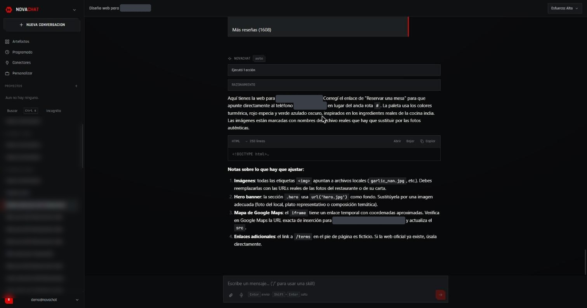

# NovaChat

> **English summary** — Self-built AI chat client (Next.js + PostgreSQL, no agent framework): own streaming tool loop, hand-written MCP client, web search and `.docx`/`.pptx`/`.xlsx` generation. Deployed with Docker → GHCR → Render.




Cliente de chat propio, escrito desde cero. Next.js (App Router) + Postgres, sin
framework de agentes por debajo: el bucle de herramientas, el prompt de sistema,
las skills y la generación de documentos son código de este repositorio.

## Qué hace

- **Chat en streaming** contra un router de modelos, con selector de esfuerzo de
  razonamiento por conversación.
- **Herramientas reales**: búsqueda web y de imágenes, lectura de páginas,
  búsqueda en el propio historial, y generación de `.docx`, `.pptx` y `.xlsx`
  con `docx`, `pptxgenjs` y `exceljs` — archivos de Office de verdad, con tablas,
  fórmulas que Excel recalcula y notas de orador.
- **Skills** que el modelo carga cuando le hacen falta, una sola vez por
  conversación, y que se pueden editar desde la aplicación.
- **Proyectos**: un sitio desde el que se chatea, con sus instrucciones y su
  contexto (PDF, Word, PowerPoint, Excel, texto o código) presentes en cada
  conversación que nace dentro.
- **Artefactos**: galería de todo lo generado, con vista previa y descarga.
- **Programado**: tareas que se repiten, disparadas desde fuera porque la
  instancia gratuita de Render se duerme.
- **Adjuntos en el mensaje**: el texto lo extrae el servidor, no el navegador.

## Estructura

```
src/app        rutas y endpoints (App Router)
src/components interfaz
src/lib        prompt, herramientas, skills, proyectos, extractor, base de datos
public         estáticos
Dockerfile     imagen de producción (salida standalone de Next)
```

`CHECKLIST.md` lleva el estado real de cada pieza, incluidos los fallos que se
encontraron probándolo y cómo se arreglaron.

## Desarrollo

```bash
npm install
npm run dev
```

Variables en `.env.local`: `DATABASE_URL`, `LLM_BASE_URL`, `LLM_API_KEY`,
`ALLOWED_EMAILS`, `DEFAULT_MODEL`, `TITLE_MODEL`. El esquema se crea solo al
arrancar, en su propio *schema* de Postgres.

## Despliegue

Cada push a `main` que toque código compila la imagen y la publica en el GHCR
privado del repositorio (`.github/workflows/app-image.yml`). Render tira de la
etiqueta `:latest`; el despliegue se lanza a mano desde su panel.

Lo que la instancia gratuita no puede hacer sola —despertarse y disparar las
tareas programadas— vive en `keepalive/`: una funcion programada de Netlify.
Empezo siendo un cron de GitHub Actions y se cambio porque **nunca llego a
ejecutarse**; el porque, y por que la ventana es de doce horas y no de
veinticuatro, estan en `keepalive/README.md`.

## Procedencia

El repositorio nació sobre una copia del árbol de LobeChat, que se usó como
punto de partida del despliegue y se ha retirado por completo: no queda ni un
fichero suyo, solo el commit inicial en el historial. NovaChat no comparte
código con él.

La skill `diseno-web` es una adaptación de `frontend-design`
([anthropics/skills](https://github.com/anthropics/skills), Apache 2.0). Las
demás están escritas para lo que las herramientas de aquí saben generar.
